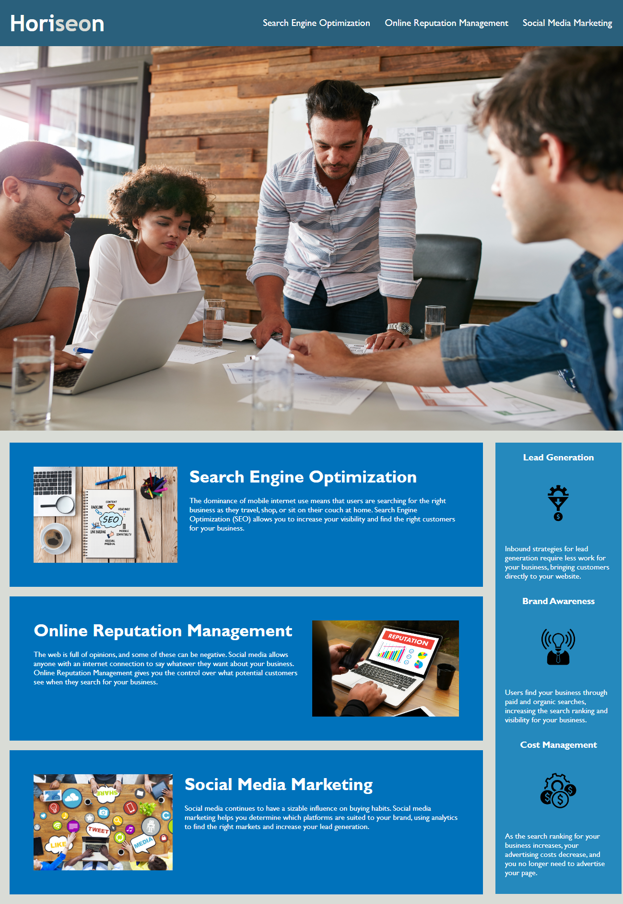

# Challenge 1: Horiseon accessibility standards

## Description

The HTML and CSS code needed to be refactored and made more accessible.  Web accessibility ensures that people with disabilities can access a website using assistive technologies.  Not only is is accessibility good for business, it also helps companies avoid litigation.

### Changelog:

Change title from "Website" to "Horiseon Home Page"

Digital Marketing Image edited.  Top portion of image no longer gets cut off at higher px.

Edit all elements to appropriate semantic elements.

Edit .header class in style.css to match html elements.

Added Alt and title for all images and icons.

Ensure all elements follow a logical structure.

Fix nav link "Search Engine Optimization".

Hide footing to resemble mock-up.

Comments added to html and css file.

CSS elements consolidated and organized to follow logical structure

### Image of website

### Link to website
[link](https://crestatic.github.io/Week_1_Challenge/)

